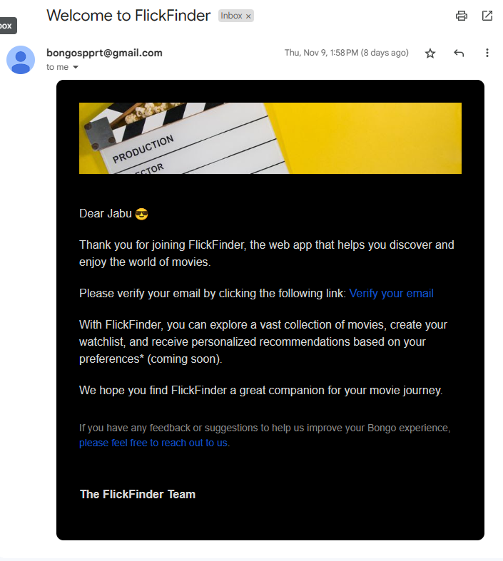
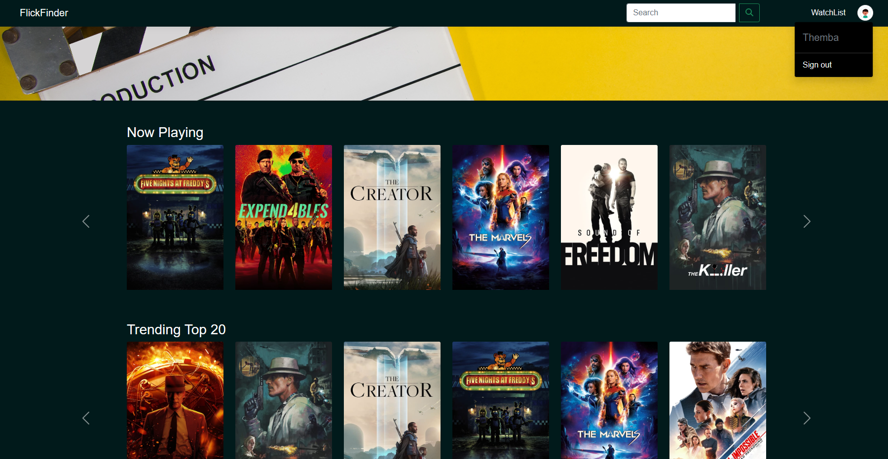
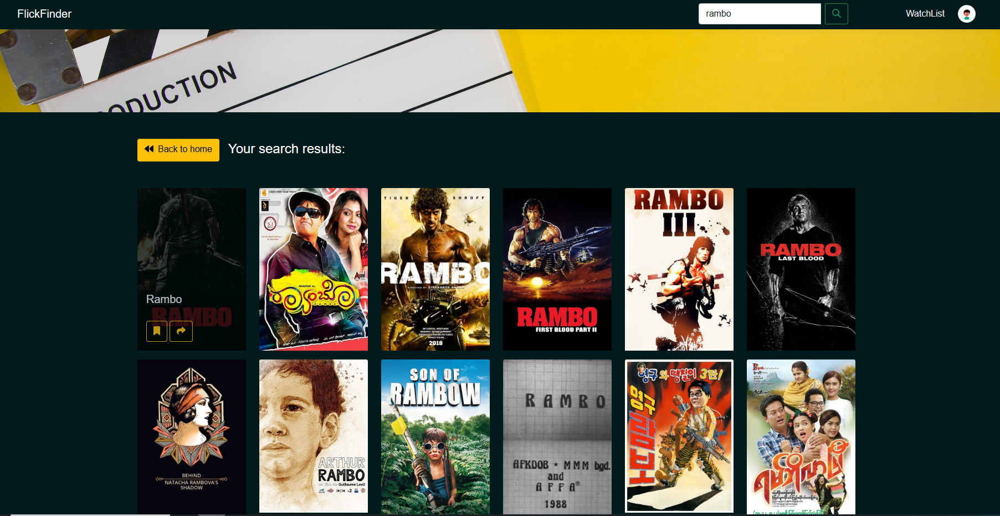
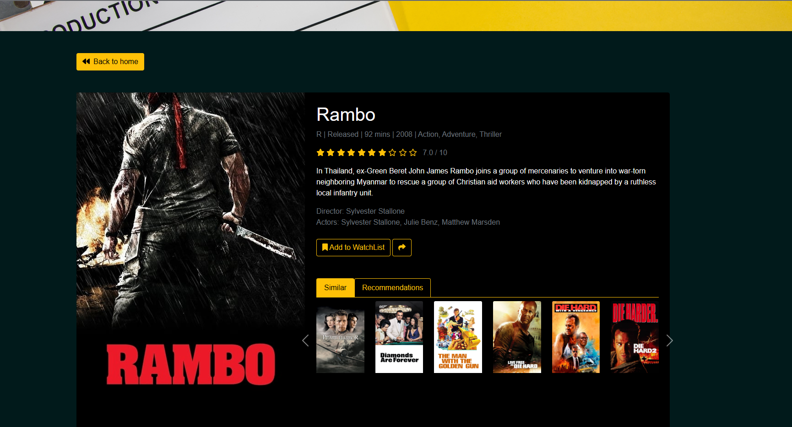

# FlickFinder Movie Recommendation App

## Overview

FlickFinder is a movie recommendation app developed for learning purposes, with a focus on honing API integration skills and improving proficiency in ASP.NET MVC. The app utilizes two main APIs - The Movie Database (TMDb) API and Open Movie Database (OMDb) API. It allows users to explore a wide range of movies, add and remove movies from a personal watchlist, and stay updated on trending, new releases, and top-rated movies. Additionally, users can register and sign in to access their personalized watchlists. The app incorporates email services for welcoming users upon registration and verifying their emails for password reset purposes.

## Getting Started

To access the FlickFinder app, visit [FlickFinder App](bongosupport-001-site2.atempurl.com/). Please note that the app's hosting status may change, and if you encounter any issues accessing it, it may be temporarily down.

## Features

1. **Search Movies:** Utilize an intuitive search bar to find movies based on titles.

2. **Personal Watchlist:** Enhance user experience by allowing them to add and remove movies from their personalized watchlists. The app follows the Repository Pattern for efficient data management.

3. **Discover Movies:** Stay informed about trending movies, new releases, and top-rated films through Bootstrap 5 components for a visually appealing user interface.

4. **User Registration and Authentication:** Implement secure user registration and authentication using Entity Framework Identity Core. Users can register for an account and access personalized watchlists upon sign-in.

5. **Email Services:**
   - Leverage MailKit with SMTP to send welcome emails upon user registration.
   - Email Verification: Ensure security by implementing email verification for password reset purposes.

## How to Use

1. **Search Movies:**
   - Use the dynamic search bar to find movies based on titles.

2. **Personal Watchlist:**
   - Sign in or register to access and manage your personal watchlist.
   - Add movies to your watchlist by clicking the "Add to Watchlist" button on movie details pages.
   - Remove movies from your watchlist using the "Remove from Watchlist" button.

3. **Discover Movies:**
   - Explore trending, new releases, and top-rated movies with a user-friendly interface designed with Bootstrap 5.

4. **User Registration:**
   - Click on the "Register" link to create a new account.

5. **User Authentication:**
   - Sign in using your registered email and password to access your personalized watchlist.
   
## Website Snippets
### Login Page

### Welcome Email

### Home Page

### Search Result Page

### Details Page

## Technologies used to mention few

- **Frontend:**
  - JavaScript
  - Bootstrap 5
  - CSS3
  - HTML5

- **Backend:**
  - ASP.NET MVC
  - Entity Framework Core
  - Entity Framework Identity Core
  - Dependency Injection

- **Database:**
  - SQL

- **Email Services:**
  - MailKit with SMTP

## Note

As of November 2023, the app is hosted, but the hosting status may change in the future. If you encounter any issues accessing the app, it may be temporarily down.

## Contributors

Contributions are welcome! If you have ideas for improvements, open an issue or submit a pull request.

Happy movie exploring! 🎬
